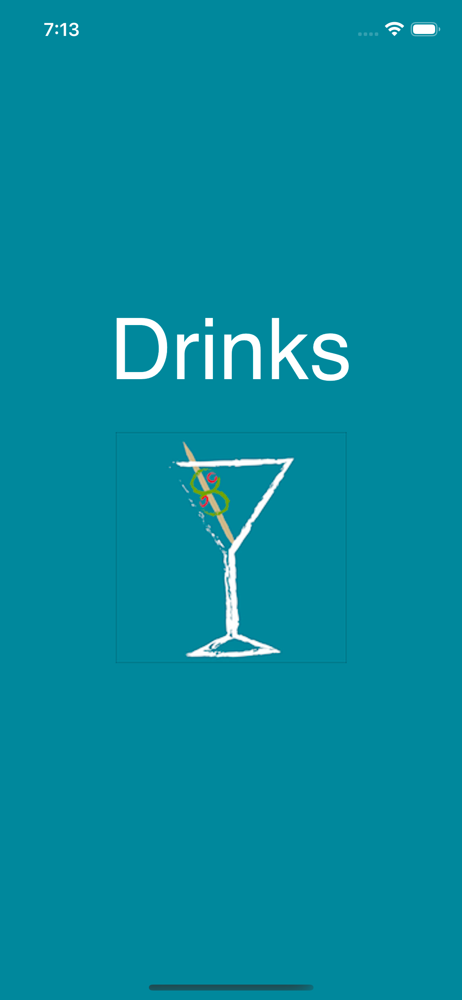
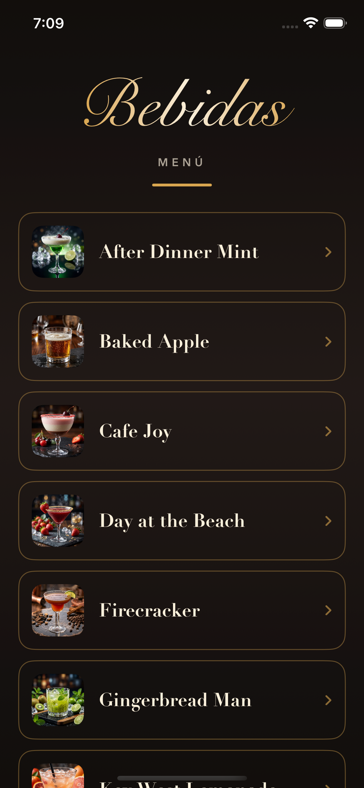
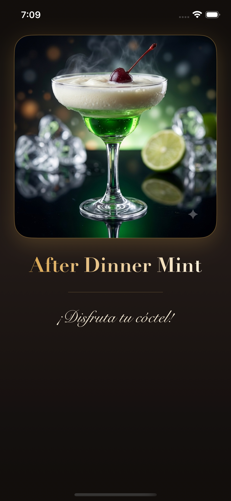

# 📱 Práctica Final – Módulo 5: Desarrollo de aplicaciones para dispositivos móviles

## 📋 Datos de Entrega

- **Alumno:** Christian Elhiu Espindola Muñoz
- **Fecha:** 5 de agosto de 2026

## 🚀 Descripción del Proyecto

Aplicación para iOS hecha en SwiftUI con Xcode. Muestra un catálogo de 15 cócteles; al tocar cualquier bebida se abre su foto en grande y se puede regresar con el botón de atrás o con swipe. Tiene tema oscuro, tipografías y colores personalizados.

## ✅ Cumplimiento de Requerimientos Funcionales

### 🚀 Configuración Inicial y Branding

- La app tiene un icono que aparece en el home del iPhone.
- Al abrir, muestra una pantalla de inicio personalizada con el nombre "Drinks".

### 🍸 Vista Principal y Catálogo de Cócteles

- Muestra la lista de las 15 bebidas con su nombre y una foto pequeña.
- Cada bebida tiene una flecha que indica que se puede seleccionar.

### 🔄 Navegación y Detalle de Bebida

- Al tocar una bebida se abre la vista de detalle con la foto del cóctel en grande.
- Para regresar se usa el botón "back" que aparece arriba o el gesto swipe.

### 📱 Configuración del Dispositivo y Restricciones

- La app solo corre en iPhone.
- La pantalla siempre está en vertical (Portrait), no rota.

### 🎨 Personalización Visual e Interfaz (Punto Extra)

- Tema oscuro con colores dorados y paleta propia.
- Tipografías distintas (Snell Roundhand, Didot, Avenir Next).
- Bordes redondeados y degradados en filas y vistas.
- Textos en español e inglés.

## 📸 Capturas de Pantalla de la Aplicación

| Launch Screen | Menú Principal | Vista de Detalle |
|---|---|---|
|  |  |  |

## 🛠️ Cómo compilar

1. Abrir el proyecto `Drinks` en Xcode.
2. Seleccionar un iPhone y presionar **Cmd + R**.
